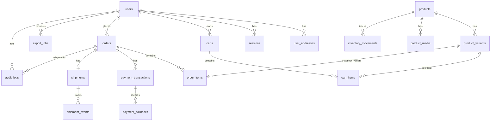

# Story 9.1 — Schema Foundation Design

## 1) Mục tiêu

Thiết kế data foundation dạng quan hệ cho các domain cốt lõi của TMDT để làm source of truth cho quản trị, reconciliation và truy vết. Tài liệu này là handoff trực tiếp cho Story 9.2 (ORM + migration baseline), không bao gồm migration runtime.

## 2) Hiện trạng dữ liệu và shape đang dùng

### Identity
- `users` đang lưu JSON (`.data/users.json`) với shape chính:
  - `id`, `email`, `passwordHash`, `role`, `accountStatus`, `profile`, `createdAt`, `updatedAt`
  - `profile` gồm `fullName`, `phone`, `addresses[]`
- `sessions` đang ở in-memory Map (`session-store.js`), gồm: `token`, `userId`, `role`, `createdAt`
- `audit logs` đang lưu JSON (`.data/audit-logs.json`) với các field: `actorId`, `orderId`, `action`, `beforeStatus`, `afterStatus`, `timestamp`, `correlationId`, `metadata`

### Catalog
- In-memory `product-store.js`:
  - Product: `id`, `slug`, `name`, `category`, `description`, `price`, `thumbnail`, `media[]`, `variants[]`, `isActive`
  - Variant: `size`, `color`, `stock`

### Cart
- JSON object keyed by `userId` (`.data/carts.json`)
- Item: `productSlug`, `variantId`, `quantity`, `addedAt`

### Order
- JSON array (`.data/orders.json`)
- Order shape:
  - `id`, `userId`, `status`, `checkout`, `pricing`, `items`, `createdAt`, `updatedAt`
  - `checkout`: `selectedAddress`, `selectedShippingMethod`, `note`
  - `pricing`: `subtotal`, `shippingFee`, `discount`, `total`
  - item: `productSlug`, `variantId`, `quantity`, `title`, `price`
  - shipping enrichment: `trackingNumber`, `pickedAt`, `packedAt`, `shippedAt`

### Payment
- JSON array (`.data/payment-transactions.json`)
- Transaction shape:
  - `id`, `orderId`, `method`, `status`, `amount`, `provider`, `providerReference`, `checkoutUrl`, `retryOfTransactionId`
  - callback/idempotency: `processedIdempotencyKeys[]`, `lastIdempotencyKey`, `callbackEventTime`, `callbackReceivedAt`
  - audit time: `createdAt`, `updatedAt`

### Shipping
- Hiện chưa có shipping store riêng; dữ liệu shipping nằm trong order + external adapter response.
- Tracking adapter trả `status`, `timestamp`.

### Admin/Reporting
- Export jobs đang lưu JSON (`reports.json`) với shape: `id`, `type`, `format`, `startDate`, `endDate`, `requestedBy`, `status`, `downloadUrl`, `createdAt`

---

## 3) Glossary + enum dùng chung

### User role
- `customer`
- `admin`
- `warehouse`

### User account status
- `active`
- `locked`

### Order status
- `pending_payment`
- `pending_verification`
- `payment_failed`
- `confirmed_cod`
- `paid`
- `processing`
- `shipped`
- `delivered`
- `cancelled`
- Compatibility note: chấp nhận dữ liệu legacy `canceled` ở tầng migration/normalize và map về `cancelled` trước khi ghi DB

### Payment method
- `online`
- `cod`

### Payment transaction status
- `pending_gateway`
- `pending_verification`
- `failed`
- `paid`
- `retrying` (label/domain-level)
- `pending_cod_confirmation`

### Shipping status
- `shipped`
- `delivered`
- `degraded` (trạng thái phục vụ theo dõi sync/provider fail)

### Report export status
- `Processing`
- `Completed`
- `Failed`

---

## 4) ERD v1 (mermaid)

---

## 5) Ownership boundary theo module

- `identity`: `users`, `user_addresses`, `sessions`, `audit_logs`
- `catalog`: `products`, `product_variants`, `product_media`, `inventory_movements`
- `cart`: `carts`, `cart_items`
- `order`: `orders`, `order_items`
- `payment`: `payment_transactions`, `payment_callbacks`
- `shipping` / `warehouse`: `shipments`, `shipment_events`
- `reporting`: `export_jobs`

---

## 6) Table specs + constraints + index strategy

## 6.1 Identity

### `users`
- PK: `id` (uuid)
- Columns:
  - `email` (varchar, not null)
  - `password_hash` (varchar, not null)
  - `role` (varchar, not null)
  - `account_status` (varchar, not null)
  - `full_name` (varchar, default '')
  - `phone` (varchar, default '')
  - `created_at` (timestamptz, not null)
  - `updated_at` (timestamptz, null)
- Unique:
  - `uq_users_email(email)`
- Check:
  - `chk_users_role` in (`customer`,`admin`,`warehouse`)
  - `chk_users_account_status` in (`active`,`locked`)
- Index:
  - `idx_users_role(role)`
  - `idx_users_account_status(account_status)`
  - `idx_users_created_at(created_at)`

### `user_addresses`
- PK: `id` (uuid)
- FK:
  - `user_id` -> `users.id` (`ON DELETE CASCADE`)
- Columns:
  - `address_line` (varchar, not null)
  - `position` (smallint, not null)
  - `created_at` (timestamptz, not null)
- Unique:
  - `uq_user_addresses_user_position(user_id, position)`
  - `uq_user_addresses_user_address(user_id, address_line)`
- Check:
  - `chk_user_addresses_position` between 1 and 3
- Index:
  - `idx_user_addresses_user_id(user_id)`

### `sessions` (phase-aware)
- PK: `id` (uuid); `token_hash` giữ unique để lookup/idempotency, không dùng token làm PK
- FK:
  - `user_id` -> `users.id` (`ON DELETE CASCADE`)
- Columns:
  - `token_hash` (varchar, not null)
  - `role` (varchar, not null)
  - `expires_at` (timestamptz, not null)
  - `created_at` (timestamptz, not null)
- Unique:
  - `uq_sessions_token_hash(token_hash)`
- Index:
  - `idx_sessions_user_id(user_id)`
  - `idx_sessions_expires_at(expires_at)`

## 6.2 Catalog

### `products`
- PK: `id` (varchar theo domain hiện tại)
- Columns:
  - `slug` (varchar, not null)
  - `name` (varchar, not null)
  - `category` (varchar, not null)
  - `description` (text, not null)
  - `price_minor` (integer, not null)
  - `thumbnail_url` (varchar, null)
  - `is_active` (boolean, not null)
  - `created_at` (timestamptz, not null)
  - `updated_at` (timestamptz, null)
- Unique:
  - `uq_products_slug(slug)`
- Check:
  - `chk_products_price_non_negative` (`price_minor >= 0`)
- Index:
  - `idx_products_category_is_active(category, is_active)`
  - `idx_products_is_active(is_active)`
  - `idx_products_created_at(created_at)`

### `product_variants`
- PK: `id` (uuid)
- FK:
  - `product_id` -> `products.id` (`ON DELETE CASCADE`)
- Columns:
  - `variant_code` (varchar, not null; map từ `size-color`)
  - `size` (varchar, not null)
  - `color` (varchar, not null)
  - `stock` (integer, not null)
  - `is_active` (boolean, not null)
  - `created_at` (timestamptz, not null)
  - `updated_at` (timestamptz, null)
- Unique:
  - `uq_product_variants_product_size_color(product_id, size, color)`
  - `uq_product_variants_variant_code(variant_code)`
- Check:
  - `chk_product_variants_stock_non_negative` (`stock >= 0`)
- Index:
  - `idx_product_variants_product_id(product_id)`
  - `idx_product_variants_stock(stock)`

### `product_media`
- PK: `id` (uuid)
- FK:
  - `product_id` -> `products.id` (`ON DELETE CASCADE`)
- Columns: `url`, `position`, `created_at`
- Unique: `uq_product_media_product_position(product_id, position)`
- Index: `idx_product_media_product_id(product_id)`

### `inventory_movements`
- PK: `id` (uuid)
- FK:
  - `product_variant_id` -> `product_variants.id`
- Columns:
  - `movement_type` (varchar: import/reserve/release/adjust)
  - `quantity_delta` (integer, not null)
  - `reason` (varchar)
  - `reference_type` (varchar)
  - `reference_id` (varchar)
  - `created_at` (timestamptz, not null)
- Check:
  - `chk_inventory_movements_quantity_non_zero` (`quantity_delta <> 0`)
- Index:
  - `idx_inventory_movements_variant_created(product_variant_id, created_at)`
  - `idx_inventory_movements_reference(reference_type, reference_id)`

## 6.3 Cart

### `carts`
- PK: `id` (uuid)
- FK:
  - `user_id` -> `users.id` (`ON DELETE CASCADE`)
- Unique:
  - `uq_carts_user_id(user_id)`
- Columns: `created_at`, `updated_at`
- Index:
  - `idx_carts_user_id(user_id)`

### `cart_items`
- PK: `id` (uuid)
- FK:
  - `cart_id` -> `carts.id` (`ON DELETE CASCADE`)
  - `product_variant_id` -> `product_variants.id` (`ON DELETE RESTRICT`)
- Columns:
  - `quantity` (integer, not null)
  - `added_at` (timestamptz, not null)
  - `updated_at` (timestamptz, null)
- Unique:
  - `uq_cart_items_cart_variant(cart_id, product_variant_id)`
- Check:
  - `chk_cart_items_quantity_positive` (`quantity > 0`)
- Index:
  - `idx_cart_items_cart_id(cart_id)`
  - `idx_cart_items_variant_id(product_variant_id)`

## 6.4 Order

### `orders`
- PK: `id` (uuid)
- FK:
  - `user_id` -> `users.id` (`ON DELETE RESTRICT`)
- Columns:
  - `status` (varchar, not null)
  - `selected_address` (varchar, not null)
  - `selected_shipping_method` (varchar, not null)
  - `note` (varchar, default '')
  - `subtotal_minor` (integer, not null)
  - `shipping_fee_minor` (integer, not null)
  - `discount_minor` (integer, not null)
  - `total_minor` (integer, not null)
  - `picked_at` (timestamptz, null)
  - `packed_at` (timestamptz, null)
  - `shipped_at` (timestamptz, null)
  - `delivered_at` (timestamptz, null)
  - `cancelled_at` (timestamptz, null)
  - `created_at` (timestamptz, not null)
  - `updated_at` (timestamptz, null)
- Check:
  - `chk_orders_status` in enum order status
  - `chk_orders_money_non_negative` (`subtotal_minor>=0 and shipping_fee_minor>=0 and discount_minor>=0 and total_minor>=0`)
  - `chk_orders_total_formula` (`total_minor = subtotal_minor + shipping_fee_minor - discount_minor`)
- Index:
  - `idx_orders_user_id_created_at(user_id, created_at desc)`
  - `idx_orders_status_updated_at(status, updated_at desc)`
  - `idx_orders_created_at(created_at)`
  - `idx_orders_selected_shipping_method(selected_shipping_method)`

### `order_items`
- PK: `id` (uuid)
- FK:
  - `order_id` -> `orders.id` (`ON DELETE CASCADE`)
  - `product_variant_id` -> `product_variants.id` (`ON DELETE RESTRICT`)
- Columns:
  - `product_slug_snapshot` (varchar, not null)
  - `title_snapshot` (varchar, not null)
  - `price_minor_snapshot` (integer, not null)
  - `quantity` (integer, not null)
  - `created_at` (timestamptz, not null)
- Check:
  - `chk_order_items_quantity_positive` (`quantity > 0`)
  - `chk_order_items_price_non_negative` (`price_minor_snapshot >= 0`)
- Unique:
  - `uq_order_items_order_variant(order_id, product_variant_id)`
- Index:
  - `idx_order_items_order_id(order_id)`

## 6.5 Payment

### `payment_transactions`
- PK: `id` (uuid)
- FK:
  - `order_id` -> `orders.id` (`ON DELETE RESTRICT`)
  - `retry_of_transaction_id` -> `payment_transactions.id` (`ON DELETE SET NULL`)
- Columns:
  - `method` (varchar, not null)
  - `status` (varchar, not null)
  - `amount_minor` (integer, not null)
  - `provider` (varchar, not null)
  - `provider_reference` (varchar, null)
  - `checkout_url` (varchar, null)
  - `last_idempotency_key` (varchar, null)
  - `callback_event_time` (timestamptz, null)
  - `callback_received_at` (timestamptz, null)
  - `created_at` (timestamptz, not null)
  - `updated_at` (timestamptz, null)
- Unique:
  - `uq_payment_transactions_provider_provider_reference(provider, provider_reference)` (partial: provider_reference is not null)
  - `uq_payment_transactions_provider_last_idempotency_key(provider, last_idempotency_key)` (partial)
- Check:
  - `chk_payment_transactions_method` in (`online`,`cod`)
  - `chk_payment_transactions_status` in payment enum
  - `chk_payment_transactions_amount_non_negative` (`amount_minor >= 0`)
- Index:
  - `idx_payment_transactions_order_created(order_id, created_at desc)`
  - `idx_payment_transactions_status_updated(status, updated_at desc)`
  - `idx_payment_transactions_provider_reference(provider_reference)`

### `payment_callbacks`
- PK: `id` (uuid)
- FK:
  - `payment_transaction_id` -> `payment_transactions.id` (`ON DELETE CASCADE`)
  - `order_id` -> `orders.id` (`ON DELETE RESTRICT`)
- Consistency constraint (design): enforce callback `order_id` must match `payment_transactions.order_id` of `payment_transaction_id` (implement via composite FK or trigger/assertion in 9.2).
- Columns:
  - `idempotency_key` (varchar, not null)
  - `provider_reference` (varchar, not null)
  - `raw_status` (varchar, not null)
  - `mapped_status` (varchar, not null)
  - `event_time` (timestamptz, null)
  - `received_at` (timestamptz, not null)
  - `raw_payload` (jsonb, not null)
- Unique:
  - `uq_payment_callbacks_provider_idempotency_key(provider_reference, idempotency_key)`
- Index:
  - `idx_payment_callbacks_transaction_received(payment_transaction_id, received_at desc)`
  - `idx_payment_callbacks_order_received(order_id, received_at desc)`
  - `idx_payment_callbacks_provider_reference(provider_reference)`

## 6.6 Shipping

### `shipments`
- PK: `id` (uuid)
- FK:
  - `order_id` -> `orders.id` (`ON DELETE CASCADE`)
- Unique:
  - `uq_shipments_order_id(order_id)`
- Columns:
  - `tracking_number` (varchar, not null)
  - `carrier` (varchar, null)
  - `status` (varchar, not null)
  - `last_synced_at` (timestamptz, null)
  - `is_degraded` (boolean, not null default false)
  - `degraded_reason` (varchar, null)
  - `retryable` (boolean, not null default false)
  - `created_at` (timestamptz, not null)
  - `updated_at` (timestamptz, null)
- Unique:
  - `uq_shipments_tracking_number(tracking_number)`
- Check:
  - `chk_shipments_status` in (`shipped`,`delivered`,`degraded`)
- Index:
  - `idx_shipments_status_updated(status, updated_at desc)`
  - `idx_shipments_tracking_number(tracking_number)`

### `shipment_events`
- PK: `id` (uuid)
- FK:
  - `shipment_id` -> `shipments.id` (`ON DELETE CASCADE`)
- Columns: `status`, `event_time`, `source`, `payload` (jsonb), `created_at`
- Index:
  - `idx_shipment_events_shipment_event_time(shipment_id, event_time desc)`

## 6.7 Audit + Reporting

### `audit_logs`
- PK: `id` (uuid)
- FK:
  - `actor_id` -> `users.id` (`ON DELETE SET NULL`)
  - `order_id` -> `orders.id` (`ON DELETE SET NULL`)
- Columns:
  - `action` (varchar, not null)
  - `before_status` (varchar, null)
  - `after_status` (varchar, null)
  - `reason` (text, null)
  - `correlation_id` (varchar, null)
  - `metadata` (jsonb, null)
  - `timestamp` (timestamptz, not null)
- Index:
  - `idx_audit_logs_order_timestamp(order_id, timestamp desc)`
  - `idx_audit_logs_actor_timestamp(actor_id, timestamp desc)`
  - `idx_audit_logs_correlation_id(correlation_id)`
  - `idx_audit_logs_action_timestamp(action, timestamp desc)`

### `export_jobs`
- PK: `id` (uuid/string)
- FK:
  - `user_id` -> `users.id` (`ON DELETE SET NULL`)
- Columns:
  - `report_type` (varchar, not null)
  - `format` (varchar, not null)
  - `status` (varchar, not null)
  - `start_date` (date, not null)
  - `end_date` (date, not null)
  - `download_url` (varchar, null)
  - `created_at` (timestamptz, not null)
  - `updated_at` (timestamptz, null)
- Check:
  - `chk_export_jobs_status` in (`Processing`,`Completed`,`Failed`)
  - `chk_export_jobs_date_range` (`start_date <= end_date`)
- Index:
  - `idx_export_jobs_user_id_created(user_id, created_at desc)`
  - `idx_export_jobs_status_created(status, created_at desc)`

---

## 7) Transaction boundaries + consistency rules

## 7.1 Place order + create payment transaction

### Transaction Unit
- Một DB transaction duy nhất cho các bước:
  1. Validate cart snapshot + pricing snapshot
  2. Insert `orders`
  3. Insert `order_items`
  4. Insert transaction đầu tiên vào `payment_transactions`
  5. Clear `cart_items`/cart snapshot cho user

### Consistency Rule
- Nếu bất kỳ bước nào fail -> rollback toàn bộ.
- Không cho phép order tồn tại mà không có payment transaction khởi tạo.

### Idempotency
- Dùng client idempotency key cho place-order (đề xuất cho 9.2+) để tránh double order khi retry HTTP.

## 7.2 Payment callback reconcile

### Transaction Unit
- Một DB transaction cho callback:
  1. Validate signature + parse payload
  2. Check uniqueness `payment_callbacks(provider_reference, idempotency_key)`
  3. Insert `payment_callbacks`
  4. Update `payment_transactions.status`
  5. Map và update `orders.status`
  6. Insert `audit_logs`

### Consistency Rule
- Callback duplicate theo idempotency key phải no-op (idempotent success).
- `provider_reference` phải trỏ đúng transaction thuộc order đang reconcile.

### Compensation
- Nếu update order fail sau khi callback đã được ghi nhận: rollback transaction để không sinh trạng thái lệch payment/order.

## 7.3 Shipment status update (warehouse + provider sync)

### Transaction Unit
- Warehouse action (`pick`/`pack`/`create_shipment`) cập nhật order + shipment + event + audit trong một transaction.
- Provider sync update cập nhật `shipments` + `shipment_events`; có thể không đổi `orders.status` nếu chưa đạt điều kiện business.

### Consistency Rule
- Không cho phép shipment event orphan (bắt buộc FK shipment).
- Khi chuyển `orders.status = shipped`, bắt buộc có `shipments.tracking_number`.

### Compensation
- Nếu ghi audit fail thì rollback update status để giữ auditability (đang là pattern hiện tại trong service).

---

## 8) Mapping guide DB `snake_case` ↔ API `camelCase`

## 8.1 Naming principle
- DB table/column: `snake_case`
- API payload/service object: `camelCase`
- Mapping thực hiện ở repository layer (Story 9.3/9.4), không đẩy mapping lên route layer.

## 8.2 Mapping examples

### User
- DB: `password_hash`, `account_status`, `created_at`
- API: `passwordHash`, `accountStatus`, `createdAt`

### Order
- DB: `selected_shipping_method`, `shipping_fee_minor`, `updated_at`
- API: `selectedShippingMethod`, `shippingFee`, `updatedAt`
- Rule money: DB lưu `_minor`; API field như `shippingFee` bắt buộc mang giá trị integer minor unit (không phải major unit).

### Payment callback
- DB: `provider_reference`, `idempotency_key`, `callback_event_time`
- API/service: `providerReference`, `idempotencyKey`, `eventTime`

### Shipment
- DB: `tracking_number`, `last_synced_at`, `degraded_reason`
- API: `trackingNumber`, `lastSyncedAt`, `degradedReason`

---

## 9) Query-driven index checklist

- Admin KPI theo thời gian:
  - `idx_orders_created_at`
  - `idx_orders_status_updated_at`
- Customer order listing/detail:
  - `idx_orders_user_id_created_at`
  - `idx_order_items_order_id`
- Payment callback/retry/status:
  - `idx_payment_transactions_order_created`
  - `idx_payment_transactions_provider_reference`
  - `uq_payment_callbacks_provider_idempotency_key`
- Reconciliation scan:
  - `idx_payment_transactions_status_updated`
  - `idx_shipments_status_updated`
  - `idx_audit_logs_action_timestamp`
- Report/export history:
  - `idx_export_jobs_user_id_created`
  - `idx_export_jobs_status_created`

---

## 10) Ready checklist cho Story 9.2 (migration implementation)

- [x] Có danh sách bảng cốt lõi cho identity/catalog/cart/order/payment/shipping/audit/reporting.
- [x] Có PK/FK/deletion policy cho toàn bộ quan hệ chính.
- [x] Có unique + check constraints cho email/slug/idempotency/status/money.
- [x] Có index strategy dựa trên query nóng hiện tại.
- [x] Có transaction boundaries cho place-order/callback/shipment-update.
- [x] Có mapping guide `snake_case` ↔ `camelCase`.
- [x] Không thay đổi API contract ở story này.
- [x] Sẵn sàng chuyển thành `prisma/schema.prisma` + migration baseline trong 9.2.

---

## 11) Out of scope xác nhận

- Không tạo migration SQL/Prisma migration file.
- Không refactor repository/service hiện hữu.
- Không cutover runtime sang DB trong story này.
