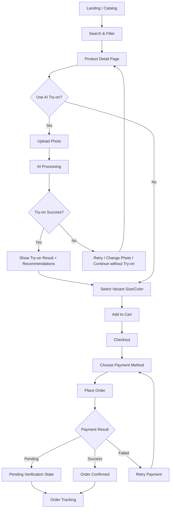
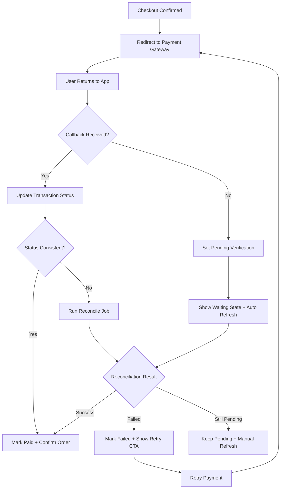
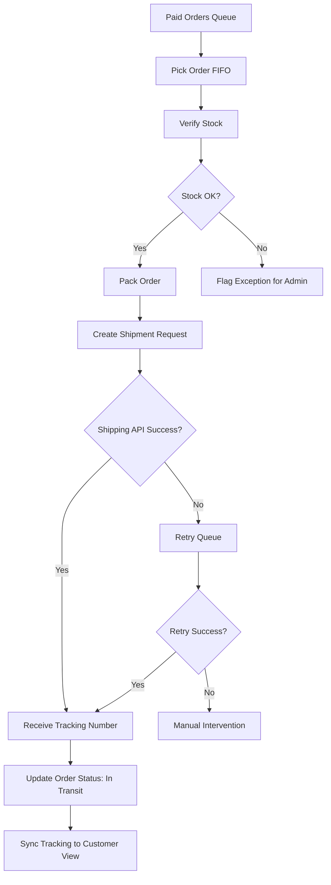

# UX Design Specification TMDT

**Author:** bao
**Date:** 2026-04-09

---

<!-- UX design content will be appended sequentially through collaborative workflow steps -->

## Executive Summary

### Project Vision

Xây dựng trải nghiệm TMĐT thời trang nơi AI try-on trở thành công cụ quyết định trước mua, giúp người dùng chọn sản phẩm/size tự tin hơn, từ đó giảm hoàn trả và cải thiện conversion. UX cần cân bằng giữa trực quan, tốc độ, và độ tin cậy trong các luồng tích hợp payment/shipping.

### Target Users

- **Khách hàng mua sắm online (primary):** cần hình dung sản phẩm trên bản thân trước khi mua, muốn giảm sai size/sai kỳ vọng.
- **Admin vận hành (secondary):** cần quản lý sản phẩm, đơn, người dùng, KPI rõ ràng và ít thao tác rườm rà.
- **Warehouse staff (secondary):** cần xử lý đơn theo hàng đợi, đóng gói và tạo vận đơn nhanh, giảm lỗi thao tác.

### Key Design Challenges

- **Giảm bất định trước mua:** biến try-on thành trải nghiệm đủ tin cậy để ảnh hưởng quyết định mua.
- **Xử lý trạng thái phức tạp sau checkout/payment:** tránh mơ hồ “đã thanh toán hay chưa”, đồng bộ trạng thái xuyên payment-kho-vận chuyển.
- **Duy trì tốc độ trải nghiệm trên các màn hình nặng:** đặc biệt PDP, try-on và tracking, trong khi vẫn đảm bảo SEO cho trang public.

### Design Opportunities

- **Decision-centric UX:** thiết kế PDP + try-on + recommendation thành một flow liên tục, giúp người dùng chốt mua nhanh hơn.
- **Trust UX cho payment/tracking:** trạng thái rõ, thông báo nhất quán, recovery path minh bạch khi timeout/callback chậm.
- **Role-optimized workspaces:** dashboard admin và màn hình kho vận tối ưu theo nhiệm vụ để giảm thao tác và lỗi vận hành.

## Core User Experience

### Defining Experience

Trải nghiệm cốt lõi của TMDT là “try-before-buy confidence loop”: người dùng khám phá sản phẩm, thử đồ AI, nhận gợi ý phù hợp, và hoàn tất mua hàng với mức tự tin cao hơn so với mua sắm chỉ dựa trên ảnh tĩnh. Giá trị UX nằm ở việc giảm bất định trước mua và giảm rủi ro quyết định sai.

### Platform Strategy

- Nền tảng chính: **web app responsive** (desktop + mobile web).
- Kiểu tương tác: ưu tiên touch trên mobile, mouse/keyboard trên desktop.
- Không đặt trọng tâm offline mode trong MVP; ưu tiên online reliability + fallback rõ ràng.
- SEO cho khu vực public (catalog/PDP), trải nghiệm ứng dụng mượt cho khu vực authenticated (cart/checkout/orders).

### Effortless Interactions

- Từ PDP mở try-on nhanh, upload ảnh và xem kết quả không rời ngữ cảnh mua hàng.
- Chọn size/màu và thêm vào giỏ với phản hồi tức thì, rõ trạng thái còn hàng.
- Checkout ngắn gọn, giảm nhập liệu lặp lại, hiển thị tổng tiền và phương thức thanh toán rõ ràng.
- Khi callback/payment chậm: tự động chuyển trạng thái “chờ xác minh” + hướng dẫn hành động kế tiếp, tránh người dùng phải đoán.
- Theo dõi đơn hiển thị tiến trình rõ và cập nhật đều, có fallback polling khi realtime không ổn định.

### Critical Success Moments

- **Aha moment:** người dùng nhìn kết quả try-on và cảm thấy đủ tin để chốt sản phẩm/size.
- **Checkout confidence moment:** người dùng xác nhận đơn/thanh toán mà không mơ hồ trạng thái giao dịch.
- **Post-purchase trust moment:** người dùng theo dõi đơn minh bạch, biết chính xác đơn đang ở bước nào.
- **Make-or-break flow:** nếu try-on khó dùng hoặc payment status mập mờ, trải nghiệm tổng thể sẽ thất bại.

### Experience Principles

- **Decision-first UX:** mọi màn hình chính phải hỗ trợ quyết định mua nhanh và chắc chắn hơn.
- **Trust through clarity:** luôn ưu tiên minh bạch trạng thái (try-on, payment, order, shipping).
- **Seamless progression:** giảm tối đa chuyển ngữ cảnh và thao tác thừa trong luồng mua hàng.
- **Graceful recovery:** lỗi/timeout phải có thông điệp rõ, hành động tiếp theo rõ, và không làm mất tiến trình người dùng.

## Desired Emotional Response

### Primary Emotional Goals

- **Primary goal:** Người dùng cảm thấy **tự tin và yên tâm** khi quyết định mua sản phẩm thời trang online.
- **Secondary goals:** cảm giác trải nghiệm **mượt, rõ ràng, đáng tin**, đặc biệt ở các bước try-on, checkout, và theo dõi đơn.
- Sản phẩm cần tạo cảm giác “mình đang kiểm soát quyết định mua”, thay vì “đánh cược”.

### Emotional Journey Mapping

- **Lần đầu khám phá:** tò mò và hy vọng (AI try-on có thể giúp chọn đúng hơn).
- **Trong luồng cốt lõi (PDP → try-on → checkout):** tập trung, tự tin tăng dần theo từng bước xác nhận.
- **Sau khi đặt hàng:** nhẹ nhõm và tin tưởng nhờ trạng thái thanh toán/đơn minh bạch.
- **Khi có lỗi/timeout:** vẫn cảm thấy được hướng dẫn, không hoang mang vì luôn có trạng thái rõ + bước tiếp theo rõ.
- **Khi quay lại sử dụng:** cảm giác quen thuộc, nhanh, và đáng tin để tiếp tục mua sắm.

### Micro-Emotions

- **Cần tăng:** Confidence, Trust, Accomplishment, Reassurance.
- **Có thể thêm nhẹ:** Delight ở khoảnh khắc xem kết quả try-on/gợi ý phù hợp.
- **Cần giảm tối đa:** Confusion, Anxiety, Skepticism, Frustration.
- **Điểm nhạy cảm nhất:** sau thanh toán và lúc chờ cập nhật tracking.

### Design Implications

- **Confidence →** hiển thị rõ mức phù hợp (try-on + gợi ý + trạng thái tồn kho) trước khi người dùng chốt mua.
- **Trust →** chuẩn hóa thông điệp trạng thái thanh toán/đơn hàng; luôn có nguồn trạng thái hiện tại và timestamp cập nhật.
- **Calm under failure →** lỗi phải có ngôn ngữ dễ hiểu, lý do ngắn gọn, và CTA cụ thể (thử lại/thanh toán lại/liên hệ hỗ trợ).
- **Accomplishment →** sau mỗi bước quan trọng (try-on thành công, đặt đơn thành công) cần có feedback xác nhận rõ ràng.
- **Delight vừa đủ →** animation/transition tinh gọn, không làm chậm flow mua hàng.

### Emotional Design Principles

- **Clarity over cleverness:** ưu tiên rõ ràng trạng thái hơn hiệu ứng.
- **Confidence by evidence:** mọi quyết định mua được hỗ trợ bằng thông tin trực quan và nhất quán.
- **Recovery without panic:** lỗi không làm mất tiến trình; luôn có đường phục hồi đơn giản.
- **Trust is continuous:** từ khám phá đến hậu mua, giọng điệu và trạng thái phải nhất quán, đáng tin.

## UX Pattern Analysis & Inspiration

### Inspiring Products Analysis

**Shopee**
- Mạnh ở discovery flow: danh mục + tìm kiếm + filter rất nhanh.
- PDP ưu tiên thông tin mua hàng thực dụng (giá, biến thể, tồn kho, vận chuyển).
- Luồng checkout quen thuộc, giảm ma sát cho người dùng phổ thông.

**Lazada**
- Mạnh ở cấu trúc thông tin rõ ràng và hierarchy tương đối tốt cho mua sắm.
- Tổ chức nội dung sản phẩm theo khối giúp so sánh nhanh trước khi quyết định.
- Theo dõi đơn và trạng thái vận chuyển tương đối trực quan.

**TikTok Shop**
- Mạnh ở chuyển đổi từ khám phá → quan tâm → mua qua nội dung trực quan (video/live).
- Tạo cảm giác “thấy được sản phẩm trong ngữ cảnh thật”, phù hợp định hướng try-on.
- Interaction tốc độ cao, mobile-first, dễ kích hoạt hành động mua nhanh.

### Transferable UX Patterns

- **Discovery nhanh + cá nhân hóa gợi ý:** áp dụng cho catalog và recommendation của TMDT.
- **PDP tập trung quyết định mua:** ưu tiên biến thể size/màu, tình trạng hàng, và CTA rõ.
- **Visual-first confidence:** học từ TikTok Shop để tăng tính trực quan trước mua, kết hợp AI try-on.
- **Checkout đơn giản:** giữ ít bước, thông tin rõ, giảm nhập liệu thừa.
- **Order tracking dễ hiểu:** timeline trạng thái rõ, cập nhật nhất quán.

### Anti-Patterns to Avoid

- Giao diện quá tải khuyến mãi/banner làm loãng mục tiêu chọn đúng sản phẩm/size.
- Pop-up dày đặc hoặc dark pattern gây áp lực mua nhanh.
- Trạng thái thanh toán/đơn hàng thiếu minh bạch khi callback chậm hoặc lỗi.
- Nhồi quá nhiều nội dung social/giải trí làm đứt mạch checkout.
- Thông điệp lỗi kỹ thuật khó hiểu, không có hành động phục hồi rõ.

### Design Inspiration Strategy

**What to Adopt**
- Discovery pattern mạnh (search/filter/recommendation) từ Shopee/Lazada.
- Visual commerce pattern từ TikTok Shop để tăng tự tin trước mua.
- Checkout + tracking pattern rõ ràng, ít ma sát.

**What to Adapt**
- Giảm độ “ồn” của thương mại đại trà, giữ trải nghiệm tập trung vào decision-first UX.
- Điều chỉnh recommendation theo mục tiêu “đúng sản phẩm/đúng size”, không chỉ kích thích mua thêm.
- Tùy biến trạng thái payment/tracking cho các edge case cần độ tin cậy cao.

**What to Avoid**
- FOMO-heavy UI và các cơ chế thúc ép mua không minh bạch.
- Dồn quá nhiều ưu đãi làm giảm niềm tin vào chất lượng quyết định mua.
- Bất kỳ pattern nào làm người dùng mơ hồ trạng thái giao dịch và đơn hàng.

## Design System Foundation

### 1.1 Design System Choice

Chọn hướng **Themeable Design System** dựa trên **Tailwind CSS** và bộ component tái sử dụng theo chuẩn nội bộ dự án (ưu tiên kiến trúc component rõ ràng, có thể mở rộng dần).

### Rationale for Selection

- **Phù hợp kiến trúc đã chọn:** dự án đã dùng Next.js + Tailwind, nên không tạo thêm độ phức tạp không cần thiết.
- **Cân bằng tốc độ và tùy biến:** nhanh để triển khai MVP nhưng vẫn đủ linh hoạt để thể hiện bản sắc sản phẩm.
- **Nhất quán multi-agent:** dễ chuẩn hóa token, component API, trạng thái và variant để nhiều agent cùng phát triển không lệch chuẩn.
- **Tối ưu cho scope học thuật/pilot:** tránh over-engineering từ custom design system toàn phần ngay giai đoạn đầu.

### Implementation Approach

- Thiết lập **foundation tokens**: màu, typography, spacing, radius, shadow, motion.
- Xây dựng **core components** trước: Button, Input, Select, Modal, Toast, Badge, Tabs, Card, Table, Pagination.
- Chuẩn hóa **state variants** cho tất cả component: default / hover / active / focus / disabled / loading / error / success.
- Tạo pattern riêng cho các flow trọng yếu:
  - Product card & PDP blocks
  - Try-on result panel
  - Checkout step blocks
  - Payment status & Order tracking timeline
- Áp dụng nguyên tắc accessibility baseline: focus-visible, contrast, semantic labels.

### Customization Strategy

- **Adopt:** utility-first + reusable components cho tốc độ phát triển.
- **Adapt:** tinh chỉnh token và component variant theo cảm xúc mục tiêu (confidence, trust, calm).
- **Constrain:** hạn chế số variant và style tự phát để giữ nhất quán xuyên team.
- **Evolve:** MVP dùng core set; post-MVP mở rộng dần advanced components và pattern library theo dữ liệu sử dụng thực tế.

## 2. Core User Experience

### 2.1 Defining Experience

Defining experience của TMDT là luồng “Try-before-buy confidence”: người dùng từ khám phá sản phẩm chuyển ngay sang thử đồ AI trong ngữ cảnh mua hàng, nhận tín hiệu phù hợp (hình ảnh try-on + gợi ý + trạng thái biến thể), rồi đưa ra quyết định mua với mức tự tin cao.

### 2.2 User Mental Model

- Người dùng hiện tại thường mua quần áo online bằng ảnh mẫu + review, nên luôn lo sai form/sai size.
- Kỳ vọng tự nhiên của họ: “cho tôi thấy gần giống thực tế trước khi trả tiền”.
- Họ muốn hệ thống:
  - dễ dùng như các sàn TMĐT quen thuộc,
  - phản hồi nhanh,
  - và đặc biệt minh bạch trạng thái thanh toán/đơn hàng.
- Điểm dễ gây khó chịu: try-on chậm/khó hiểu, hoặc trạng thái giao dịch mập mờ sau checkout.

### 2.3 Success Criteria

- Người dùng hoàn thành flow PDP → try-on → add-to-cart mà không cần học thêm thao tác phức tạp.
- Người dùng hiểu rõ “đang ở bước nào” và “hành động kế tiếp là gì” trong checkout/payment.
- Người dùng cảm nhận quyết định mua chắc chắn hơn sau try-on so với trước try-on.
- Trạng thái đơn và thanh toán luôn có thông điệp rõ (thành công/chờ xác minh/thất bại có hướng xử lý).
- Toàn bộ interaction cho cảm giác nhanh, liền mạch, không rối.

### 2.4 Novel UX Patterns

- **Established patterns được giữ:** search/filter, PDP info hierarchy, giỏ hàng, checkout, tracking timeline.
- **Novel layer được thêm:** AI try-on như một bước “validation trước mua” nằm ngay trong luồng mua sắm.
- **Cách tiếp cận phù hợp:** kết hợp pattern quen thuộc của e-commerce với một interaction mới (try-on) nhưng không phá mental model hiện có.
- **Nguyên tắc:** mới ở giá trị, quen ở thao tác.

### 2.5 Experience Mechanics

**1. Initiation**
- Người dùng vào PDP, thấy CTA rõ: “Thử đồ với AI”.
- Hệ thống hiển thị yêu cầu ảnh đầu vào ngắn gọn, dễ hiểu.

**2. Interaction**
- Người dùng tải ảnh, chọn biến thể sản phẩm, gửi xử lý.
- Hệ thống hiển thị progress rõ ràng trong thời gian xử lý.
- Kết quả trả về ngay trong ngữ cảnh PDP, kèm gợi ý sản phẩm/biến thể liên quan.

**3. Feedback**
- Thành công: xác nhận rõ kết quả đã sẵn sàng + CTA “Chọn size/Thêm vào giỏ”.
- Thất bại/timeout: thông điệp thân thiện + hành động cụ thể (thử lại/đổi ảnh/tiếp tục không dùng try-on).
- Checkout/payment: trạng thái có nhãn rõ và timestamp cập nhật.

**4. Completion**
- Người dùng hoàn tất đặt hàng và biết chắc trạng thái giao dịch.
- Màn hình theo dõi đơn thể hiện tiến trình minh bạch và cập nhật nhất quán.
- Hệ thống dẫn người dùng tự nhiên sang bước tiếp theo (xem đơn, tiếp tục mua, theo dõi vận chuyển).

## Visual Design Foundation

### Color System

**Visual intent:** hiện đại, rõ ràng, đáng tin; ưu tiên độ đọc và minh bạch trạng thái.

**Core palette (đề xuất):**
- Primary: `#2563EB` (Blue 600) — CTA chính, hành động cần tin cậy.
- Primary Hover: `#1D4ED8`
- Secondary Accent: `#7C3AED` — điểm nhấn AI/try-on nhẹ.
- Background: `#F8FAFC`
- Surface: `#FFFFFF`
- Text Primary: `#0F172A`
- Text Secondary: `#475569`
- Border/Divider: `#E2E8F0`

**Semantic colors:**
- Success: `#16A34A`
- Warning: `#D97706`
- Error: `#DC2626`
- Info: `#0284C7`

**Semantic mapping principles:**
- CTA mua hàng/tiến trình dùng Primary.
- Trạng thái đơn/payment dùng semantic rõ nhãn + icon + màu.
- Không dùng màu đơn lẻ để truyền nghĩa; luôn có text label đi kèm.

### Typography System

**Tone:** modern, trustworthy, dễ đọc nhanh.

**Font strategy:**
- Primary UI font: `Inter` (fallback: `system-ui`, `Segoe UI`, `Roboto`, sans-serif).
- Numeric/transaction emphasis: dùng tabular figures cho giá trị tiền và timestamp khi cần.

**Type scale (đề xuất):**
- H1: 32/40, semibold
- H2: 28/36, semibold
- H3: 24/32, semibold
- H4: 20/28, medium
- Body L: 18/28, regular
- Body M: 16/24, regular
- Body S: 14/20, regular
- Caption: 12/16, medium

**Usage rules:**
- Tránh quá nhiều kích cỡ; ưu tiên hierarchy nhất quán.
- Nội dung transactional (giá, trạng thái, mã đơn) dùng weight/contrast cao hơn body thông thường.

### Spacing & Layout Foundation

**Spacing system:** base 8px scale (`4, 8, 12, 16, 24, 32, 40, 48, 64` theo bội linh hoạt).

**Layout direction:**
- Web responsive, mobile-first.
- Grid: 12 cột desktop, 8 cột tablet, 4 cột mobile.
- Container width ưu tiên readability cho PDP/checkout/tracking.

**Density strategy:**
- PDP và checkout: cân bằng giữa thông tin và khoảng thở.
- Dashboard admin/kho vận: mật độ cao hơn nhưng vẫn giữ nhóm thông tin rõ.
- Thành phần quan trọng (CTA, tổng tiền, trạng thái đơn) luôn có khoảng cách nổi bật.

**Component spacing principles:**
- Khoảng cách trong component theo scale cố định.
- Khoảng cách giữa section lớn hơn rõ rệt so với khoảng cách nội bộ.
- Form controls giữ chiều cao nhất quán để giảm sai thao tác.

### Accessibility Considerations

- Contrast tối thiểu theo WCAG AA cho text và thành phần tương tác.
- Focus state rõ ràng (outline/ring) cho keyboard navigation.
- Không dựa vào màu sắc đơn thuần để biểu đạt lỗi/trạng thái.
- Cỡ chữ body tối thiểu 16px cho luồng chính trên mobile web.
- Trạng thái loading/disabled/error cần có cả visual + text feedback.

## Design Direction Decision

### Design Directions Explored

Đã khám phá 6 hướng thiết kế (D1–D6) cho các trục: hierarchy, mật độ thông tin, mức ưu tiên visual try-on, clarity giao dịch, và khả năng mở rộng theo vai trò vận hành.

### Chosen Direction

**Direction được chọn: Hybrid D2 + D4 + D6**

- **D2 (Visual Confidence) làm lõi storefront:** ưu tiên khối try-on trực quan và tín hiệu phù hợp để hỗ trợ quyết định mua.
- **D4 (Speed Minimal) làm nguyên tắc tương tác:** giảm số bước, giảm nhiễu giao diện, đẩy nhanh flow từ PDP đến checkout.
- **D6 (Hybrid Operator) làm kiến trúc trải nghiệm đa vai trò:** customer-facing UI và admin/warehouse workspace tách biệt nhưng nhất quán ngôn ngữ trạng thái.

### Design Rationale

- Phù hợp trực tiếp với mục tiêu cảm xúc đã chốt: **confidence + trust + calm**.
- Cân bằng giữa “thấy để tin” (try-on visual-first) và “mua nhanh, rõ ràng” (minimal friction).
- Hỗ trợ tốt yêu cầu vận hành đa vai trò của hệ thống mà không làm storefront phức tạp.
- Giảm rủi ro UX phổ biến của e-commerce (quá tải thông tin, mơ hồ trạng thái thanh toán).

### Implementation Approach

- **Storefront (Customer):**
  - PDP ưu tiên try-on block lớn + gợi ý liên quan.
  - CTA và thông tin quyết định mua đặt theo hierarchy tối giản.
  - Checkout giữ cấu trúc ngắn gọn, trạng thái rõ ràng theo từng bước.
- **Transactional UX:**
  - Payment/order/tracking dùng status model thống nhất, có timestamp và next action.
  - Edge cases (timeout/callback chậm) có thông điệp recovery rõ.
- **Operator UX (Admin/Warehouse):**
  - Màn hình density cao hơn, tối ưu theo nhiệm vụ (quản lý đơn, xử lý kho, báo cáo).
  - Dùng chung token màu/typography/status semantics để tránh lệch hệ thống.
- **Design governance:**
  - D2 cho visual priority, D4 cho interaction simplicity, D6 cho role-aware structure.
  - Mọi màn hình mới phải pass checklist: decision-first, status-clarity, low-friction, role-fit.

## User Journey Flows

### Journey 1 — Customer Happy Path (Discover → Try-on → Buy)

Mục tiêu: giúp người dùng đi từ quan tâm đến đặt hàng thành công với mức tự tin cao, giảm rủi ro sai size/sai kỳ vọng.

### Journey 2 — Customer Payment Edge Case (Timeout/Delayed Callback)

Mục tiêu: loại bỏ cảm giác mơ hồ sau thanh toán bằng trạng thái rõ + hành động phục hồi rõ.

### Journey 3 — Warehouse Fulfillment (Paid Order → Shipment)

Mục tiêu: xử lý đơn nhanh, nhất quán trạng thái, giảm lỗi khi tạo vận đơn.

### Journey Patterns

- **Navigation Patterns**
  - Progressive flow theo ngữ cảnh (PDP → Try-on → Cart → Checkout).
  - Status-driven navigation sau checkout (success/pending/failed có CTA riêng).
- **Decision Patterns**
  - Mỗi decision point chỉ 1 hành động primary rõ.
  - Luôn có đường quay lại an toàn (retry/edit/continue without).
- **Feedback Patterns**
  - Trạng thái rõ bằng label + timestamp + next action.
  - Error feedback có hướng phục hồi ngay trong cùng màn hình.

### Flow Optimization Principles

- **Minimize steps to value:** ưu tiên đưa người dùng đến kết quả try-on và quyết định mua nhanh.
- **Reduce cognitive load:** giữ cấu trúc thông tin nhất quán giữa các flow.
- **State transparency first:** payment/tracking phải luôn có trạng thái xác định.
- **Graceful recovery:** timeout/lỗi không làm mất tiến trình; có retry path rõ.
- **Role-fit efficiency:** flow customer tối giản; flow admin/warehouse tối ưu thao tác nghiệp vụ.

## Component Strategy

### Design System Components

**Foundation components (reuse từ design system):**
- Button, IconButton
- Input, Select, Checkbox, Radio, Switch
- Modal, Drawer, Popover, Tooltip
- Tabs, Breadcrumb, Pagination
- Card, Table, Badge, Avatar
- Toast, Alert, Skeleton, Progress
- Empty state, Error state, Loading state patterns

**Coverage nhận định:**
- Bao phủ tốt cho luồng cơ bản catalog/PDP/cart/checkout.
- Cần custom thêm cho các điểm nghiệp vụ đặc thù AI try-on, trạng thái giao dịch, và vận hành kho.

### Custom Components

### TryOnConfidencePanel
**Purpose:** hiển thị kết quả try-on + tín hiệu phù hợp để hỗ trợ quyết định mua.
**Usage:** PDP sau khi user upload ảnh và xử lý thành công.
**Anatomy:** ảnh kết quả, fit confidence, variant suggestion, CTA mua.
**States:** idle, processing, success, failed, timeout.
**Variants:** compact (mobile), expanded (desktop).
**Accessibility:** alt text ảnh, live region cho trạng thái xử lý, keyboard focus rõ.
**Interaction Behavior:** cho retry nhanh, đổi ảnh, hoặc continue without try-on.

### PaymentStatusTimeline
**Purpose:** minh bạch trạng thái thanh toán/đơn sau checkout.
**Usage:** trang xác nhận đơn + trang theo dõi đơn.
**Anatomy:** status label, timestamp, source, next-action CTA.
**States:** success, pending-verification, failed, retrying.
**Variants:** inline summary, full timeline.
**Accessibility:** semantic list/timeline, icon + text song song.
**Interaction Behavior:** refresh status, retry payment, chuyển sang tracking.

### VariantFitSelector
**Purpose:** chọn size/màu gắn với tín hiệu từ try-on.
**Usage:** PDP trước add-to-cart.
**Anatomy:** variant chips, stock state, fit hint, price delta.
**States:** available, low-stock, out-of-stock, selected, disabled.
**Variants:** chip/grid/list.
**Accessibility:** keyboard navigation theo nhóm lựa chọn, ARIA selected/state.

### RecoveryActionBanner
**Purpose:** hiển thị thông điệp lỗi có hướng phục hồi rõ.
**Usage:** các điểm timeout/lỗi AI/payment/shipping.
**Anatomy:** severity, short reason, CTA chính + CTA phụ.
**States:** info, warning, error, success-recovered.
**Accessibility:** role=alert cho trạng thái khẩn, text dễ hiểu, không chỉ dựa vào màu.

### OperatorQueueBoard
**Purpose:** hỗ trợ warehouse/admin xử lý danh sách đơn nhanh theo trạng thái.
**Usage:** dashboard vận hành.
**Anatomy:** queue columns/filters, SLA indicator, quick actions.
**States:** normal, overloaded, blocked, syncing.
**Variants:** board view, table view.
**Accessibility:** keyboard filter/sort, status labels rõ.

### Component Implementation Strategy

- Build custom components trên cùng token system (color/type/spacing/motion).
- Chuẩn hóa state API cho component: `default | loading | success | warning | error | disabled`.
- Tách rõ:
  - `components/ui` cho generic primitives
  - `components/features` cho domain components (try-on/payment/ops).
- Mọi component mới bắt buộc có:
  - accessibility notes
  - state matrix
  - usage guideline ngắn.

### Implementation Roadmap

**Phase 1 — Core buying confidence**
- VariantFitSelector
- TryOnConfidencePanel
- PaymentStatusTimeline (summary mode)

**Phase 2 — Reliability & recovery**
- RecoveryActionBanner
- PaymentStatusTimeline (full mode)
- Unified loading/error state wrappers

**Phase 3 — Operator efficiency**
- OperatorQueueBoard
- Role-specific data cards (admin/warehouse)
- Advanced status filters and batch actions

## UX Consistency Patterns

### Button Hierarchy

- **Primary action (mỗi màn hình chỉ 1 primary):** dùng cho hành động quyết định tiến trình như Thêm vào giỏ, Xác nhận thanh toán, Tiếp tục bước kế.
- **Visual:** nền primary, chữ trắng, tương phản cao, kích thước touch tối thiểu 44px.
- **State chuẩn:** `default | hover | pressed | loading | disabled`.
- **Loading behavior:** khóa double-submit, hiển thị label theo ngữ cảnh (ví dụ: “Đang xử lý thanh toán...”).
- **Secondary action:** cho hành động phụ trợ như xem chi tiết, lưu nháp, thay đổi phương thức.
- **Tertiary/text action:** cho thao tác rủi ro thấp như quay lại, bỏ qua, xem thêm.
- **Destructive action:** chỉ dùng cho hủy/xóa, bắt buộc có bước xác nhận hậu quả.
- **Accessibility:** luôn có focus ring keyboard, không truyền nghĩa chỉ bằng màu.

### Feedback Patterns

- **Success:** thông điệp ngắn gọn + CTA bước tiếp theo rõ (ví dụ: Thanh toán thành công → Theo dõi đơn).
- **Error:** cấu trúc bắt buộc gồm điều gì xảy ra + ảnh hưởng + cách khôi phục.
- **Warning:** dùng cho trạng thái cần chú ý nhưng chưa fail (ví dụ đồng bộ tracking chậm).
- **Info:** dùng cho trạng thái tiến trình (đang xử lý try-on, đang xác minh thanh toán).
- **Placement rule:**
  - Inline feedback cho lỗi field/form
  - Banner cho lỗi hệ thống hoặc cảnh báo toàn luồng
  - Toast cho thông tin ngắn, không critical
- **Recovery-first:** lỗi AI/payment/shipping luôn có CTA rõ: thử lại, đổi phương thức, liên hệ hỗ trợ.

### Form Patterns

- **Label luôn hiển thị**, không thay hoàn toàn bằng placeholder.
- **Group field theo logic nghiệp vụ:** nhận hàng, thanh toán, ghi chú.
- **Validation 2 lớp:** realtime nhẹ cho format cơ bản + validation đầy đủ khi submit.
- **Error display:** hiển thị ngay dưới field, nêu rõ cách sửa; focus về field lỗi đầu tiên khi submit fail.
- **Data persistence:** không reset toàn bộ form khi fail một phần.
- **Try-on/variant forms:** hiển thị đồng thời selector biến thể + fit confidence để hỗ trợ quyết định.
- **Accessibility & mobile:** keyboard type đúng ngữ cảnh, hit area đủ lớn, liên kết semantic label-input.

### Navigation Patterns

- **Customer flow:** ưu tiên tuyến tính Discover → PDP/Try-on → Cart → Checkout → Tracking.
- **Admin/Warehouse flow:** điều hướng theo nhiệm vụ, ưu tiên queue/status/filter.
- **Role-aware consistency:** cùng ngôn ngữ trạng thái đơn hàng giữa Customer/Admin/Warehouse.
- **Back/exit behavior:** wizard có quay lại an toàn, rời flow quan trọng có cảnh báo khi dữ liệu chưa lưu.
- **Mobile priority:** CTA điều hướng chính ở vùng dễ chạm, tránh ẩn hành động quan trọng.

### Additional Patterns

- **Modal/overlay:** chỉ dùng cho quyết định quan trọng; có tiêu đề rõ, đóng rõ, hành vi ESC/backdrop nhất quán.
- **Loading states:**
  - Skeleton cho danh sách/catalog
  - Progress rõ cho checkout/payment/try-on
  - Chờ lâu phải có trạng thái trung gian + lựa chọn fallback
- **Empty states:** luôn có nguyên nhân + CTA kế tiếp (ví dụ giỏ trống → quay lại danh mục).
- **Search/filter:** giữ trạng thái bộ lọc khi quay lại danh sách, có “xóa bộ lọc” rõ ràng.
- **Design system integration rules:**
  - Ưu tiên map về foundation components trước khi tạo custom
  - Reuse custom components đã chốt: `TryOnConfidencePanel`, `PaymentStatusTimeline`, `VariantFitSelector`, `RecoveryActionBanner`, `OperatorQueueBoard`
  - Một mục đích hành vi phải dùng một quy tắc nhất quán toàn hệ thống

## Responsive Design & Accessibility

### Responsive Strategy

- **Mobile-first cho customer flow:** ưu tiên thông tin quyết định mua (media, giá, biến thể, CTA, trạng thái thanh toán/đơn).
- **Desktop/tablet mở rộng theo ngữ cảnh:**
  - Customer: 2 cột ở PDP/checkout khi đủ không gian.
  - Admin/Warehouse: tăng mật độ bảng, filter panel, queue view để tối ưu thao tác.
- **Try-on panel responsive:**
  - Mobile: stack dọc (result → fit confidence → CTA).
  - Tablet/Desktop: song song kết quả + quyết định mua.
- **Navigation strategy:**
  - Mobile customer: ưu tiên hành động chính ở vùng dễ chạm, header tối giản.
  - Admin/warehouse: side navigation + sticky filter/actions trên desktop.
- **Interaction parity:** mọi chức năng cốt lõi dùng được trên touch, keyboard, và pointer.

### Breakpoint Strategy

- Chọn **mobile-first breakpoints chuẩn Tailwind**:
  - **Mobile:** `< 640px`
  - **Small tablet / large mobile:** `640–767px`
  - **Tablet:** `768–1023px`
  - **Desktop:** `1024–1279px`
  - **Large desktop:** `>=1280px`
- Quy tắc chuyển layout:
  - 1 cột mặc định cho mobile.
  - 2 cột cho PDP/checkout từ tablet.
  - Dashboard bảng + panel phụ từ desktop.
- Tối ưu theo **task breakpoint** (điểm mà hành vi người dùng thay đổi), không theo từng model thiết bị.

### Accessibility Strategy

- Mục tiêu tuân thủ: **WCAG 2.1 Level AA**.
- Yêu cầu bắt buộc:
  - Contrast tối thiểu 4.5:1 cho text thường.
  - Full keyboard navigation cho catalog, try-on, checkout, tracking và thao tác dashboard chính.
  - Focus indicator rõ ràng, nhất quán.
  - Semantic HTML + ARIA cho component tùy biến.
  - Touch target tối thiểu 44x44px.
  - Form có label rõ, error message liên kết đúng field.
  - Feedback trạng thái không phụ thuộc chỉ vào màu (kèm icon/text).
- Với payment/tracking:
  - Có live-region phù hợp cho cập nhật quan trọng.
  - Thông báo ngắn gọn, dễ hiểu, có hành động kế tiếp.

### Testing Strategy

- **Responsive testing:**
  - Kiểm tra breakpoint chính trên Chrome/Safari/Firefox/Edge.
  - Smoke test trên thiết bị thật: iOS Safari + Android Chrome.
  - Kiểm tra mạng chậm cho try-on/payment/tracking.
- **Accessibility testing:**
  - Automated scan (axe/Lighthouse) trong CI cho trang và component trọng yếu.
  - Manual keyboard-only test cho luồng mua hàng.
  - Screen reader spot-check (VoiceOver và NVDA).
  - Kiểm tra focus order, skip link, modal focus trap, form error announcement.
- **Scenario coverage ưu tiên:**
  - Happy path mua hàng
  - Payment pending/failed recovery
  - Tracking delayed sync
  - Admin/warehouse queue/filter actions

### Implementation Guidelines

- **Responsive development:**
  - Dùng đơn vị linh hoạt (`rem`, `%`) và layout fluid.
  - Áp dụng mobile-first media queries.
  - Tối ưu ảnh sản phẩm/try-on theo kích thước hiển thị.
  - Tránh fixed height gây vỡ nội dung tiếng Việt dài.
- **Accessibility development:**
  - Semantic-first markup trước khi thêm ARIA.
  - Chuẩn hóa focus ring token toàn hệ thống.
  - Mọi modal/drawer phải có focus trap + ESC close + restore focus.
  - Form validation theo pattern thống nhất (inline message + summary khi cần).
  - Component mới phải có checklist AA trước khi merge.
- **Governance:**
  - PR checklist bắt buộc mục responsive + a11y cho màn hình mới/chỉnh sửa lớn.
  - Không chấp nhận component custom nếu thiếu state matrix + keyboard behavior + a11y notes.
